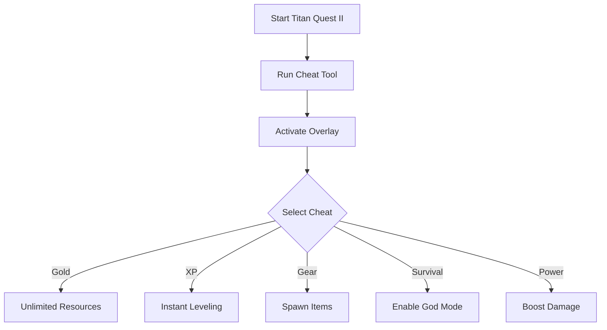

# ⚔️ Titan Quest II Cheat Tool

Titan Quest II brings back the mythological action RPG spirit—fast combat, loot farming, and epic builds. But farming gold, grinding XP, and chasing rare drops can slow down the fun. That’s why the **Titan Quest II Cheat Tool** exists—giving you instant control over loot, resources, and survival so you can focus on the battles that matter.

---

## 🔎 Overview

This cheat tool lets you bypass repetitive farming and unlock sandbox freedom:

* Add unlimited gold and crafting resources instantly
* Boost XP for faster leveling
* Toggle god mode or damage multipliers
* Spawn legendary gear and rare drops on demand
* Adjust movement speed or cooldowns

Perfect for **casual players** who want smoother progression or **hardcore fans** testing advanced builds.

---

## ⚙️ Cheat Features

* **💰 Infinite Gold** – Shop endlessly without farming.
* **⚡ Instant XP** – Level up instantly for faster skill unlocks.
* **🛡 God Mode** – Survive any battle without risk.
* **🔮 Item Spawner** – Generate legendary and mythic gear directly.
* **🔥 Damage Multiplier** – One-hit enemies with boosted power.
* **⏱ Cooldown Reset** – Spam skills with zero waiting.
* **🎛 Custom Hotkeys** – Remap every function to your playstyle.

[!NOTE]
This cheat runs **offline only**—safe for single-player sandbox fun.

---

## 🖥 Compatibility

| Platform           | Status | Notes                             |
| ------------------ | ------ | --------------------------------- |
| Windows 10/11      | ✅      | Fully supported                   |
| Steam Edition      | ✅      | Recommended                       |
| Other PC Launchers | ⚠️     | Manual path setup may be required |
| Consoles (PS/Xbox) | ❌      | Not supported                     |

---

## ⚡ Setup Instructions

1. Download and extract the cheat package.
2. Launch **Titan Quest II** normally.
3. Run `tq2_cheat.exe` as Administrator.
4. Open the cheat overlay with `F11`.
5. Toggle features via hotkeys or the panel.

```bash
# Quick example
tq2_cheat.exe --overlay --godmode --loot
```

---

## 📊 Cheat Flow



---

## ❓ FAQ

**Q: Will cheats corrupt my save file?**
A: No—changes are reversible, and saves remain safe.

**Q: Can I spawn specific items?**
A: Yes, the spawner allows you to search and generate gear.

**Q: Does it work in multiplayer?**
A: No, it’s strictly for single-player use.

**Q: Are hotkeys customizable?**
A: Absolutely—you can remap all toggles.

---

## 🚀 Final Thoughts

The **Titan Quest II Cheat Tool** removes grind, maximizes fun, and lets you explore mythic builds without limitations. Whether you want to farm gods, experiment with skills, or simply rush through story mode, this cheat tool puts the power in your hands.

---
